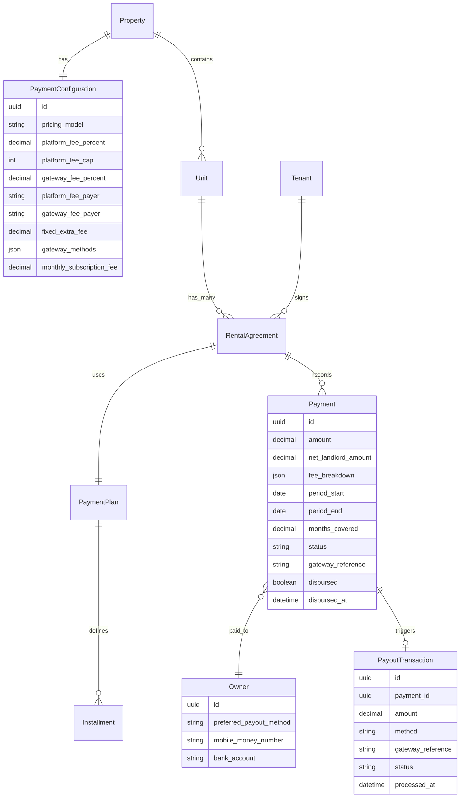
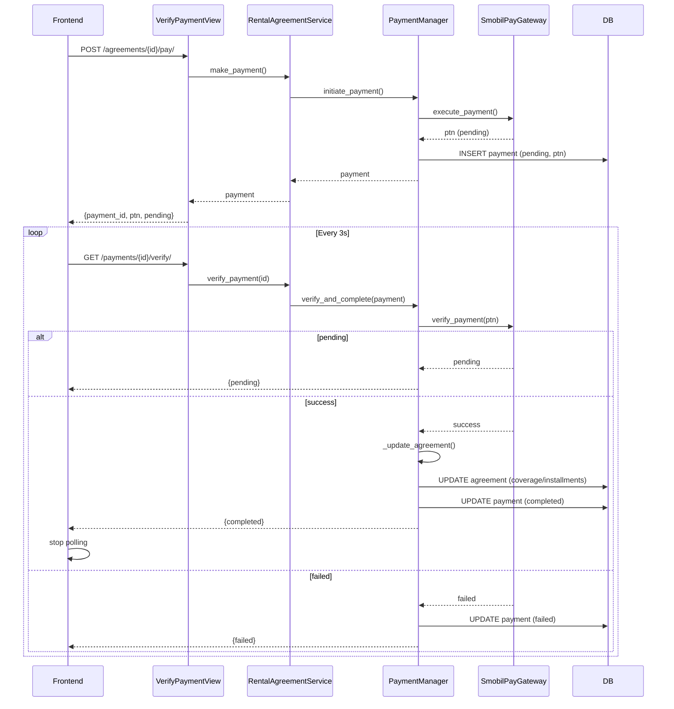
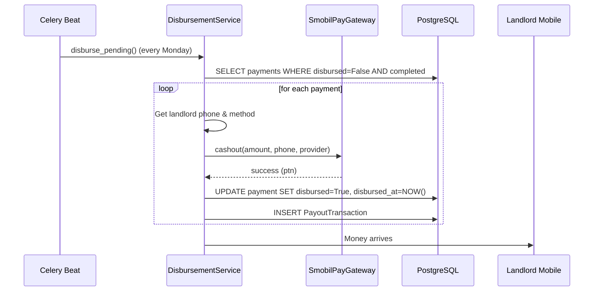

# Payment Architecture Documentation

> **Version:** 1.0  
> **Date:** 2026-04-30  
> **Status:** ✅ Implemented  
> **Audience:** Developers, System Architects, Future Maintainers

This document explains the complete payment strategy for the Cameroon rental market – from tenant payment to landlord disbursement. It covers **why** decisions were made, **how** the code is structured, and **what** every component does.

---

## Table of Contents

1. [Overview & Goals](#overview--goals)
2. [Key Design Decisions](#key-design-decisions)
3. [Core Models](#core-models)
4. [Payment Flow: Step by Step](#payment-flow-step-by-step)
5. [Fee Calculation: The RentCalculator](#fee-calculation-the-rentcalculator)
6. [Disbursement to Landlord](#disbursement-to-landlord)
7. [ER Diagram](#er-diagram)
8. [Sequence Diagrams](#sequence-diagrams)
9. [Decision Log (ADRs)](#decision-log-adrs)
10. [Future Considerations](#future-considerations)

---

## Overview & Goals

The payment system handles rent collection for rental agreements (monthly or yearly). Because tenants in Cameroon often pay irregularly, the system uses **coverage‑based** (monthly) or **installment‑based** (yearly) tracking instead of fixed leases.

**Primary goals:**

- Landlords define flexible payment rules per property (monthly multiples, installments, custom amounts).
- All mobile money payments (MTN MoMo, Orange Money) are processed via **SmobilPay**.
- **Zero trust in webhooks** – payments are confirmed only after explicit gateway verification.
- **Fee transparency** – landlords see exactly what they pay (platform fee capped at 1000 XAF) and who pays it (tenant, landlord, or split).
- **Separation of concerns** – a dedicated `PaymentManager` orchestrates all payment logic; services remain thin.

---

## Key Design Decisions

| Decision | Why |
|----------|-----|
| **Two‑phase payment** (initiate → verify) | Mobile money is asynchronous. `execute_collection` returns `pending`. The system must poll `verify_payment` before updating any agreement data. |
| **No webhooks** | SmobilPay webhooks are unreliable in low‑bandwidth environments. Polling is simpler, idempotent, and under our control. |
| **PaymentConfiguration per property** | Each property can have different fee rules (who pays, subscription vs per‑transaction). Landlords can adjust without changing code. |
| **RentCalculator as standalone class** | Fee logic is complex (capping, percentage, fixed extra, proportional custom amounts). Isolating it makes testing and future changes easy. |
| **Batch disbursement** | Landlord payouts (cashout) are done via scheduled cron, not real‑time. This avoids mobile money daily limits and reduces gateway errors. |
| **PaymentManager centralises all logic** | Without it, services would be cluttered with gateway calls, fee calculations, and agreement updates. Manager is the single source of truth. |

---

## Core Models

### PaymentConfiguration (in `apps/properties/models.py`)

Holds fee rules for a property.

```python
class PaymentConfiguration(models.Model):
    property = OneToOneField(Property)
    pricing_model = ["per_transaction", "subscription"]
    platform_fee_percent = 1.0      # % of net rent
    platform_fee_cap = 1000         # max XAF
    gateway_fee_percent = 2.0       # % on payout amount
    platform_fee_payer = ["tenant", "landlord", "split"]
    gateway_fee_payer = ["tenant", "landlord", "split"]
    fixed_extra_fee = 0             # always tenant
    gateway_methods = ["mtn_momo", "orange_money"]
```

### RentCalculator (in `apps/payments/rent_calculator.py`)

Stateless class that takes `(net_rent, config, payout_method)` and returns a breakdown:

```json
{
  "platform_fee": 1000,
  "gateway_fee": 2000,
  "fixed_extra": 0,
  "landlord_net": 97000,
  "tenant_total": 101000
}
```

### Payment (extended in `apps/payments/models.py`)

| Field | Purpose |
|-------|---------|
| `amount` | What tenant paid |
| `net_landlord_amount` | After fees, to be paid out |
| `fee_breakdown` | JSON copy of calculator output (audit trail) |
| `gateway_reference` | Stores SmobilPay `ptn` (Payment Transaction Number) |
| `status` | `pending` / `completed` / `failed` |
| `disbursed` (add) | Whether landlord has been paid |
| `disbursed_at` (add) | Timestamp of payout |

### PaymentManager (in `apps/payments/managers/payment_manager.py`)

Two public methods:

- `initiate_payment()` – creates pending payment, calls `execute_collection`, stores `ptn`. **Does not touch agreement.**
- `verify_and_complete()` – polls gateway, on success updates agreement (coverage/installments) and marks payment completed.

---

## Payment Flow: Step by Step

### Phase 1 – Initiation (tenant clicks “Pay”)

1. **Frontend** → `POST /api/v1/payments/agreements/{id}/pay/`  
2. **View** (`MakePaymentView`) checks permissions.  
3. **Service** (`RentalAgreementService.make_payment`) delegates to `PaymentManager.initiate_payment()`.  
4. **PaymentManager**:
   - Loads `PaymentConfiguration`, net rent, landlord payout method.
   - Calls `RentCalculator` to get expected total and fees.
   - Validates `amount` against allowed terms / custom amount rules.
   - Calls gateway:
     - `create_payment_intent` → `quoteId`
     - `execute_payment` → `ptn` (pending)
   - Creates `Payment` record with `status="pending"`, stores `ptn` in `gateway_reference`.
   - **No changes to `RentalAgreement`**.
5. Returns `{"payment_id": "...", "ptn": "...", "status": "pending"}`.

### Phase 2 – Verification (polling)

Frontend polls every 3 seconds: `GET /api/v1/payments/{payment_id}/verify/`

1. **View** (`VerifyPaymentView`) calls `RentalAgreementService.verify_payment()`.
2. **PaymentManager.verify_and_complete()`**:
   - Calls `gateway.verify_payment(ptn)`.
   - If status == `pending` → return `{"status":"pending"}` (continue polling).
   - If status == `failed` → mark payment `failed`, stop.
   - If status == `success`:
     - Re‑run fee calculator (in case custom amount was used, recalc landlord net proportionally).
     - **Update agreement**:
       - Monthly mode: recalc `coverage_end_date`, save via repository.
       - Yearly mode: apply payment to installments, update `installment_status`.
     - Update payment: `status="completed"`, fill `period_start/end`, `months_covered`, `net_landlord_amount`, `fee_breakdown`.
     - Return `{"status":"completed"}`.
3. Frontend stops polling, shows success.

### Phase 3 – Disbursement (cron job, e.g., every Monday)

1. **DisbursementService** (new file) selects payments with:
   - `current_status = "completed"`
   - `disbursed = False`
   - Landlord has a valid payout method (MTN/Orange Money or bank).
2. For each payment:
   - If mobile money: call `SmobilPayGateway.cashout(amount, phone, provider)`.
     - Gateway uses a different `payItemId` (cashout). Already implemented in your `smobilpay_gateway.py`.
   - If bank transfer: trigger external API (placeholder).
   - If success, set `payment.disbursed = True`, `disbursed_at = now()`.
   - Log payout in `PayoutTransaction` model (to be added).
3. Landlord receives money on mobile wallet / bank account.

---

## Fee Calculation: The RentCalculator

The calculator ensures **landlord never loses money** on gateway fees and platform fee never exceeds 1000 XAF.

### Formula (per‑transaction model)

Let `R` = net rent (amount landlord expects)

```
platform_fee = min(R × platform_fee_percent%, platform_fee_cap)
gateway_fee = if payout_method in gateway_methods: R × gateway_fee_percent% else 0
fixed_extra = config.fixed_extra_fee

tenant_total = R
landlord_net = R

if platform_fee_payer == "tenant": tenant_total += platform_fee
else: landlord_net -= platform_fee

if gateway_fee_payer == "tenant": tenant_total += gateway_fee
else: landlord_net -= gateway_fee

tenant_total += fixed_extra
```

### Custom amount handling

If `allow_custom_amount = True` and tenant pays a different total, landlord net is recalculated proportionally:

```
landlord_net = actual_paid × (original_landlord_net / original_tenant_total)
```

This prevents the landlord from absorbing fees when tenant underpays.

### Subscription model

When `pricing_model = "subscription"`:

- No per‑transaction fees.
- Landlord pays a fixed `monthly_subscription_fee` (invoiced separately).
- Tenant pays exactly `R`.
- This is ideal for high‑volume landlords.

---

## Disbursement to Landlord

Disbursement is **not real‑time** because:

- Mobile money providers have daily limits on cashout transactions.
- Batched payouts reduce API costs and network errors.
- Landlords expect weekly or monthly summaries, not per‑payment.

**Implementation plan:**

1. Add `disbursed = models.BooleanField(default=False)` and `disbursed_at` to `Payment`.
2. Create `DisbursementService` with method `disburse_pending()`.
3. Schedule a Celery beat task (e.g., every Monday 09:00) that calls this service.
4. For each payment, call `SmobilPayGateway.cashout()` using the landlord's saved phone number.
5. On success, mark `disbursed=True`. On failure, retry after 1 hour (max 3 retries).

The gateway cashout method is already implemented in `smobilpay_gateway.py` (see `cashout()`).

---

## ER Diagram



---

## Sequence Diagrams

### Payment Initiation & Verification (No Webhook)



### Disbursement (Batch)



---

## Decision Log (ADRs)

| ADR | Decision | Rationale |
|-----|----------|-----------|
| **001** | Use two‑phase payment (initiate + verify) | Mobile money is async; `execute_collection` returns `pending`. We must poll `verify_payment` before updating contract state. |
| **002** | Reject webhooks, use polling only | Unreliable delivery in Cameroon. Polling gives us full control, idempotency, and easier debugging. |
| **003** | Platform fee capped at 1000 XAF | Encourages landlords to list high‑value properties without feeling penalised. Keeps trust high. |
| **004** | Allow landlord to choose who pays fees (tenant / landlord / split) | Landlords can compete on listed rent or absorb fees. Flexibility is key in a competitive market. |
| **005** | Implement subscription model per property | For professional landlords with many units. Reduces per‑transaction friction. |
| **006** | Batch disbursements (weekly) | Avoids mobile money daily limits and reduces API errors. Landlords prefer lump sums. |
| **007** | Move all payment logic into PaymentManager | Keeps services thin, centralises gateway & fee logic, easier to test and change. |

---

## Future Considerations

1. **Real‑time disbursement** – For VIP landlords, offer instant payout via separate high‑volume API (if gateway supports).
2. **Subscription invoicing** – Create monthly `SubscriptionInvoice` model and retry logic for failed subscription payments.
3. **Partial custom amount with fee proportionality** – Already implemented; keep as is.
4. **Multi‑owner properties** – Currently uses first owner for payout. Enhance to split payout by ownership percentage.
5. **Reporting** – Add `PayoutTransaction` model to track every disbursement.

---

## Appendix: Where to Find the Code

| Component | File Path |
|-----------|-----------|
| `PaymentConfiguration` | `apps/properties/models.py` |
| `RentCalculator` | `apps/payments/rent_calculator.py` |
| `PaymentManager` | `apps/payments/managers/payment_manager.py` |
| `RentalAgreementService` | `apps/payments/services.py` |
| `MakePaymentView`, `VerifyPaymentView` | `apps/payments/views.py` |
| `SmobilPayGateway` | `apps/payments/gateway_SDKs/smobilpay_gateway.py` |
| `DisbursementService` (to be added) | `apps/payments/services/disbursement.py` |

---

> **Maintainer Note:** This document should be updated whenever the payment flow changes. The sequence diagrams and ER diagram must stay in sync with the code. When in doubt, follow the `PaymentManager` – it is the single source of truth.