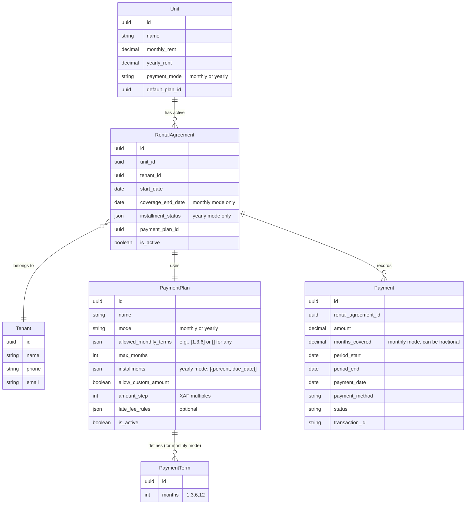
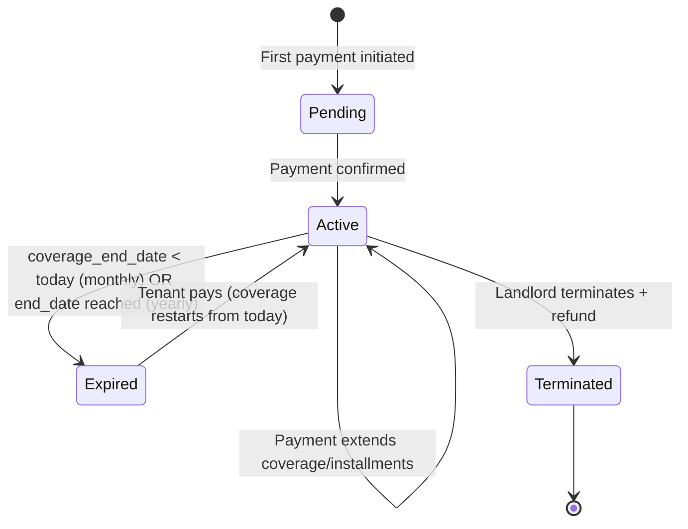

# Payment Architecture for Cameroon Rental Market (No Leases)

## Version 1.0 – Architecture Only

---

## 1. Core Philosophy

- **No leases** – only payment agreements that track coverage or installment progress.
- **Landlord defines the rules** per unit (payment mode, allowed terms, custom amounts).
- **Tenant pays as they wish** – within the landlord’s rules.
- **System calculates coverage or installment completion** automatically.

---

## 2. Entity Relationship Diagram (ERD)

**Key relationships:**
- A `Unit` can have many `RentalAgreement`s over time, but only one active at a time.
- A `RentalAgreement` uses exactly one `PaymentPlan` (the one active on the unit at creation time).
- `PaymentTerm` is a simple lookup table for allowed monthly terms (1,3,6,12). The `allowed_monthly_terms` in `PaymentPlan` references these IDs or just stores integers directly. I’ve shown it as JSON for simplicity.

---

## 3. Payment Scenarios (Cameroon Unconventional Cases)

lets walk through scenarios from both **landlord** and **tenant** perspectives, focusing on real chaos.

---

### Scenario 1: Landlord wants only 6‑month prepayment, but tenant can only pay 3 months now

**Landlord setup:**
- Unit monthly rent = 100,000 XAF.
- Payment plan: `mode=monthly`, `allowed_monthly_terms=[6]` (only 6‑month blocks allowed), `allow_custom_amount=false`.

**Tenant situation:** Has only 300,000 XAF now, needs to move in.

**What happens:**
- System shows tenant only “Pay 6 months = 600,000 XAF”. Tenant cannot pay 3 months because it’s not allowed.
- Tenant contacts landlord. Landlord can:
  - Temporarily edit the plan to `allowed_monthly_terms=[3,6]` for this unit (or for this specific agreement if we add an override field). Then tenant pays 3 months.
  - Or landlord creates a new plan “3‑month special” and assigns it to the unit just for this tenant.

**System behaviour after override:**
- Tenant pays 300,000 → coverage_end_date = today + 3 months.
- After 3 months, tenant must pay another 300,000 to reach 6 months (if landlord re‑restricts to 6‑month blocks). Or landlord leaves 3‑month option open.

**Lesson:** Landlord can change the plan per unit, but existing agreements are not automatically updated unless we add a `plan_override` field on `RentalAgreement`. We recommend that: each agreement stores the `payment_plan_id` at creation time, and changes to unit plan do not affect active agreements. For one‑off flexibility, landlord creates a new plan and assigns it to the unit, then tenant pays.

---

### Scenario 2: Tenant overpays for yearly installment (pays full year at once, but plan had 60/40 split)

**Landlord setup:**
- Yearly rent = 360,000 XAF.
- Plan: installments = [60%, 40%], `allow_custom_amount=true`.

**Tenant action:** Pays 360,000 in one go.

**System logic:**
- First, system checks if amount ≤ total yearly rent (360k). Yes.
- It then applies the payment to installments in order:
  - Installment 1 (60% = 216,000) fully paid. Remaining amount = 360k - 216k = 144k.
  - Installment 2 (40% = 144,000) fully paid. Remaining = 0.
- `installment_status` becomes: `paid_percentage=100`, `next_installment_index=null`, `remaining_for_current=0`.
- Agreement is fully paid. Tenant can stay until end_date (start_date + 1 year).
- Receipt shows full payment.

**If tenant overpays (e.g., 400,000):**
- System rejects with message: “Amount exceeds total yearly rent (360,000). Please enter a lower amount.”

---

### Scenario 3: Tenant pays custom amount that is not a multiple of the step value

**Landlord setup:** `amount_step = 10` (only multiples of 10 XAF allowed).

**Tenant enters:** 157,250 XAF.

**System response:** “Amount must be a multiple of 10. Suggested amounts: 157,250 (not allowed), 157,240 or 157,260.”

**Tenant adjusts** to 157,260 → accepted.

**Why this step?** Mobile money and cash transactions often have rounding. It prevents weird decimal amounts that complicate reconciliation.

---

### Scenario 4: Tenant pays after coverage has expired (monthly mode)

**Current state:** Coverage ended 3 days ago. Unit status = vacant, but tenant is still living there (common in Cameroon).

**System logic:**
- When tenant attempts to pay, system detects that `coverage_end_date < today`.
- Instead of rejecting, system can:
  - **Option A (strict):** Require landlord to mark unit as occupied again or create a new agreement. But that’s extra work.
  - **Option B (flexible):** Allow payment, but set `coverage_end_date = today + months_paid`. This effectively resets coverage from today, ignoring the expired gap. This is more tenant‑friendly and reflects reality – tenant pays to continue from today.

We choose **Option B** for Cameroon. The system should not penalise late payment by forcing a new agreement. It simply extends coverage from today.

**Example:** Coverage ended 5th March. Today is 10th March. Tenant pays 1 month (150k). New coverage_end_date = 10th March + 30 days = 9th April. Tenant is covered from 10th March to 9th April. The 5 days gap is ignored (no backdating).

**But what about the unpaid days?** The landlord lost those days. That’s a business risk. The system can optionally send a notification to landlord: “Tenant paid late – coverage restarted from today. The period from 5th to 9th March is unpaid.” Landlord can then decide to charge extra or not. We don’t automate back‑charging.

---

### Scenario 5: Tenant pays partial amount for monthly mode, but landlord only wants full months

**Landlord setup:** `allow_custom_amount = false` (tenant must pay exact months).

**Tenant action:** Tries to enter 75,000 XAF (half of monthly rent 150k).

**System response:** “Custom amounts are not allowed for this unit. Please select a number of months.” Tenant must choose 1 month (150k) or 2 months (300k), etc.

**If landlord wants to allow partials:** Set `allow_custom_amount = true`. Then tenant can pay any amount (subject to step). System calculates fractional months covered.

---

### Scenario 6: Tenant pays for 2 months, but then landlord increases rent before the second month starts

**Landlord action:** On 1st April, increases monthly rent from 150k to 180k. Tenant had paid for April and May on 1st March (2 months prepaid).

**System logic:**
- The coverage for April and May was already paid at the old rate. The rent increase applies only to **future payments** (starting from June).
- When tenant pays again in June, they pay the new rate.
- No refund or extra charge for already covered months.

**What if the increase happens mid‑month?** Same rule – only affects payments made after the effective date.

---

### Scenario 7: Landlord wants to force tenant to pay a specific percentage of yearly rent as first installment, but tenant can only pay less

**Landlord setup:** Yearly rent 300k, first installment 60% (180k), `allow_custom_amount=false`.

**Tenant has only 150k.**

**What can tenant do?** They cannot pay 150k because custom amounts are disabled. They must contact landlord. Landlord can:
- Temporarily set `allow_custom_amount=true` for this agreement (via an override flag on `RentalAgreement`).
- Or landlord creates a new payment plan with a smaller first installment (e.g., 50%) and reassigns to the unit.

**System design:** Each `RentalAgreement` has a `payment_plan_override` field (nullable) that can temporarily override the unit’s plan. This allows one‑off flexibility without changing the unit’s default plan.

---

### Scenario 8: Tenant pays for 12 months upfront, but after 6 months landlord sells the unit

**New landlord situation:** New owner takes over. The existing tenant has paid for another 6 months.

**System behaviour:**
- The `RentalAgreement` remains attached to the unit. When unit ownership changes (we need a `PropertyOwnership` model, which you already have), the agreement stays with the unit.
- New landlord inherits the agreement and the coverage. They cannot terminate without refunding the tenant.
- If new landlord wants tenant out, they must follow the refund process: calculate unused months (6), refund that amount to tenant, then mark agreement as terminated.

**Refund calculation:** Unused months = max(0, (coverage_end_date - today) / 30). Refund amount = unused_months × monthly_rent (original rate). System records a refund payment (negative amount) and sets `is_active=false`.

---

### Scenario 9: Tenant pays using multiple methods (e.g., 50k cash + 100k mobile money) for one payment

**Requirement:** Tenants often split payments across different channels.

**System design:**
- Allow a single `Payment` record to have multiple `PaymentSplit` child records, each with its own method and amount.
- Or, more simply, allow multiple payments on the same day for the same agreement. The system sums them and updates coverage/installments once the total reaches a threshold.

**Example:** Tenant wants to pay 150k (1 month). They pay 50k via Orange Money and 100k via MTN MoMo. System creates two separate `Payment` records (same day). The agreement’s coverage extension is calculated based on the **sum** of payments made on that day (or within a configurable window, e.g., 24 hours). We can implement a “pending batch” concept.

**Simpler approach:** Tenants make one payment at a time. If they need to split, they make two separate payments. The system processes each payment independently – e.g., first 50k extends coverage by 0.33 months, second 100k extends by 0.66 months. Total coverage = 1 month. This is mathematically correct and avoids complexity.

We’ll adopt the independent payment approach.

---

### Scenario 10: Tenant wants to pay for next year before current year ends (yearly mode)

**Landlord setup:** Yearly rent 300k, tenant already paid 100% for current year (end_date = 31 Dec).

**Tenant action on 1 Nov:** Pays 300k for next year.

**System logic:**
- Current agreement is still active (until 31 Dec). The system should not allow a second active agreement for the same unit and tenant.
- Instead, tenant is paying for the **next period**. We need to either:
  - Create a new agreement with start_date = 1 Jan (future), and accept payment now. The payment is recorded against the future agreement.
  - Or extend the current agreement’s end_date by one year and mark the payment as covering the extension.

We choose: **Create a new agreement with future start date**. This keeps each year separate and clean. The tenant can prepay, and the system will activate the new agreement automatically when the current one ends.

**Implementation:** When a tenant pays while an active agreement exists and the payment amount equals the full yearly rent, the system creates a `RentalAgreement` with `start_date = current_agreement.end_date + 1 day`, `is_active = false`, and stores the payment against it. On the day the current agreement expires, a cron job activates the next agreement.

---

## 4. State Transitions for Rental Agreement

**Notes:**
- `Pending` state is optional – we can create agreement only on successful payment.
- `Expired` is not final – tenant can reactivate by paying.
- `Terminated` is final – landlord has refunded and unit is vacant.

---

## 5. Key Decision Points

| Decision | Choice | Rationale |
|----------|--------|-----------|
| Agreement creation | On first successful payment | Avoids abandoned drafts |
| Coverage restart after expiry | Extend from today, ignore gap | Matches Cameroon reality |
| Overpayments | Reject | Avoids confusion |
| Custom amount step | 10 XAF | Mobile money rounding |
| Landlord plan change effect | Does not affect active agreements | Contract stability |
| Partial payments in monthly mode | Allowed only if `allow_custom_amount=true` | Landlord control |
| Split payments across methods | Multiple independent payments | Simple, no batching |
| Prepayment for next year | Create future agreement | Clean separation |

---

## 6. API Endpoints (Conceptual)

| Endpoint | Method | Description |
|----------|--------|-------------|
| `/api/v1/units/<id>/payment-plans/` | GET | List available plans for unit |
| `/api/v1/units/<id>/payment-options/` | GET | Calculate possible payment amounts based on current agreement |
| `/api/v1/agreements/` | POST | Create agreement (first payment) |
| `/api/v1/agreements/<id>/pay/` | POST | Make a payment |
| `/api/v1/agreements/<id>/refund/` | POST | Landlord terminates and refunds |
| `/api/v1/agreements/<id>/status/` | GET | Get coverage/installment status |

---

## 7. Conclusion

This architecture handles the chaos of Cameroon rental payments while giving landlords fine‑grained control. It avoids Western lease complexity and focuses on what matters: **payments and coverage**.

Do you want me to produce the **actual Django model code** based on this architecture? We can start with the models, then implement the payment logic step by step.