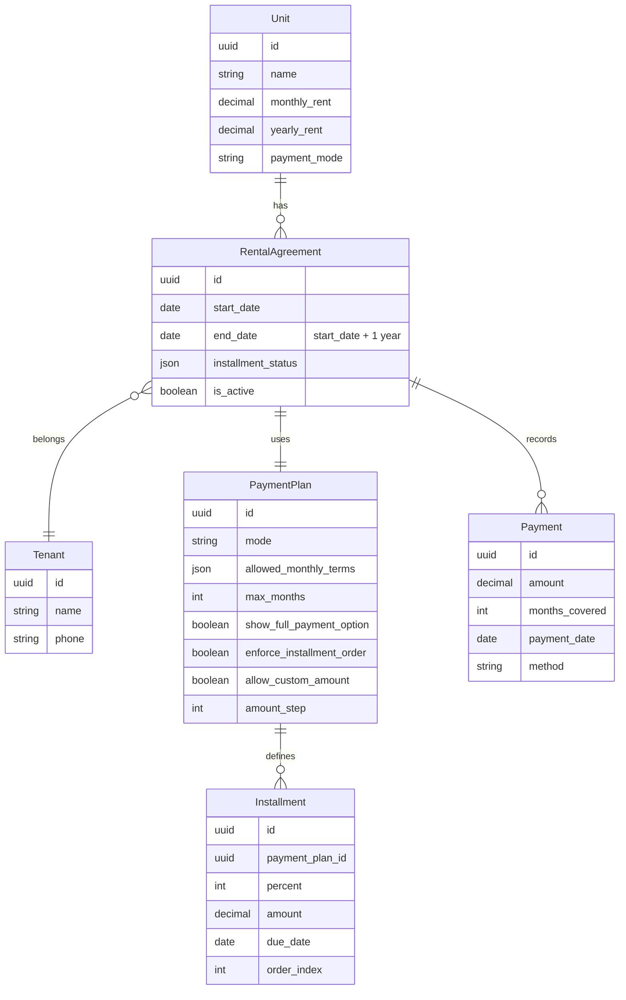

You're absolutely right. Forcing a tenant to manually type an amount and guess which installment they're paying is terrible UX. The system should **show the options clearly**:

- **60% (180,000 XAF)** – first installment
- **40% (120,000 XAF)** – second installment  
- **100% (300,000 XAF)** – pay in full

And only if the landlord enables "custom amount", there can be an **"Other amount"** button that opens a numeric input.

Let me revise the architecture to reflect this, focusing on the **yearly installment mode** and making the payment flow explicit.

---

# Revised Payment Architecture – Yearly Installment Mode (Explicit Options)

## 1. How the Landlord Sets Up a Yearly Plan

Landlord creates a `PaymentPlan` with:

- `mode = yearly`
- `yearly_rent = 300,000` (set on the unit, but can be overridden in plan)
- `installments = [
    {"percent": 60, "label": "First Installment", "due_date": "2026-03-01"},
    {"percent": 40, "label": "Second Installment", "due_date": "2026-09-01"}
  ]`
- `show_full_payment_option = true` (default true)
- `allow_custom_amount = false` (default false, can be enabled)

The system automatically calculates the **amount for each installment**:
- 60% → 180,000 XAF
- 40% → 120,000 XAF
- 100% → 300,000 XAF

Landlord can also set **due dates** for reminders.

---

## 2. Tenant Payment Flow (Yearly Mode)

When tenant views their agreement status, the system shows:

```text
Your yearly rent: 300,000 XAF (1st March 2026 – 28th February 2027)

Choose payment option:
[ ] Pay 60% – 180,000 XAF (first installment, due by 1st March)
[ ] Pay 40% – 120,000 XAF (second installment, due by 1st September)
[ ] Pay 100% – 300,000 XAF (full year)

[Other amount]  (only if landlord enabled custom amounts)
```

**If tenant selects a predefined option:**
- System validates that the installment is still pending (not already paid).
- If paying 60% and it's already fully paid, option is disabled.
- If paying 40% before 60% is fully paid, system can either:
  - Block it (require sequential installments), or
  - Allow it, but apply payment to first unpaid balance (i.e., pay 60% remainder first, then rest to 40%).
  We choose **sequential** – installments must be paid in order unless landlord overrides.

**If landlord enabled custom amounts and tenant clicks "Other amount":**
- Tenant enters any amount (subject to step value, e.g., multiples of 10).
- System applies it to the earliest unpaid installment (or splits across installments if the amount exceeds the current due).
- Example: First installment remaining = 180,000. Tenant enters 200,000. System pays 180,000 to first, and 20,000 to second (reducing second from 120,000 to 100,000). Then shows updated status.

---

## 3. Monthly Mode with Explicit Month Selection

For monthly mode, the system already shows month options based on `allowed_monthly_terms`:

- If `allowed_monthly_terms = [1,3,6]`, tenant sees buttons:
  - 1 month (150,000 XAF)
  - 3 months (450,000 XAF)
  - 6 months (900,000 XAF)
- If `allowed_monthly_terms = []` (any months up to max), tenant sees a dropdown or slider to choose number of months, and system calculates total.
- If `allow_custom_amount = true`, also show "Other amount" button.

No guessing.

---

## 4. Updated Data Model for Explicit Options

We don't need to change the database schema much, only the interpretation and UI logic.

### PaymentPlan (add fields)
```python
class PaymentPlan(TimeStampedUUIDModel):
    # ... existing fields ...
    show_full_payment_option = models.BooleanField(default=True)  # for yearly mode
    enforce_installment_order = models.BooleanField(default=True)  # sequential installments
```

### RentalAgreement.installment_status (JSON)
```json
{
  "installments": [
    {"percent": 60, "paid_amount": 0, "remaining": 180000, "status": "pending"},
    {"percent": 40, "paid_amount": 0, "remaining": 120000, "status": "pending"}
  ],
  "total_paid": 0,
  "total_remaining": 300000,
  "next_installment_index": 0
}
```

When a payment is made for a specific installment (e.g., user clicked "Pay 60%"), the system updates only that installment's `paid_amount` and `remaining`. If the user pays a custom amount, the system applies to the earliest pending installment (or splits if amount exceeds).

---

## 5. Payment Scenarios with Explicit Options

### Scenario 1: Tenant pays first installment (60%) as a predefined option

- System sees that `next_installment_index = 0` and the selected option matches that installment.
- Creates payment of 180,000 XAF.
- Updates `installments[0].paid_amount = 180000`, `remaining = 0`, `status = "paid"`.
- `next_installment_index` becomes 1.
- `total_paid = 180000`, `total_remaining = 120000`.
- If `due_date` is set, system clears the reminder for first installment.

### Scenario 2: Tenant accidentally tries to pay second installment (40%) before first is paid

- System checks `enforce_installment_order`. If true, shows error: "First installment of 180,000 XAF must be paid before second installment."
- If false, allows payment, but applies it to first unpaid balance (i.e., pays first installment first). This is more flexible but may confuse tenants. We default to `enforce_installment_order = true`.

### Scenario 3: Tenant pays full year (100%) upfront

- System creates a single payment of 300,000 XAF.
- Marks all installments as paid.
- `next_installment_index = null`, `total_remaining = 0`.
- Agreement is fully paid.

### Scenario 4: Landlord enables custom amount, tenant pays 150,000 (less than first installment)

- System checks `allow_custom_amount = true`.
- Applies 150,000 to first installment. Updates `installments[0].remaining = 30,000`, `paid_amount = 150,000`.
- `next_installment_index` remains 0 (first not fully paid).
- `total_paid = 150,000`, `total_remaining = 150,000`.
- Tenant can later pay the remaining 30,000 (custom or via the "Pay 60%" button which now shows remaining 30,000? Actually, the 60% button should still show 180,000 – that's confusing. Better to disable the 60% button when custom partial has been made, and only show "Pay remaining 30,000" as a custom option. We can add a dynamic "Pay remaining for current installment" button.)

To keep it simple: when custom partials are used, the system no longer shows the predefined percentage buttons for that installment. Instead, it shows "Remaining for first installment: 30,000 XAF – pay now". This is clearer.

---

## 6. User Interface Mock (Yearly Mode)

```
┌─────────────────────────────────────────────────┐
│  Rental Agreement #1234                          │
│  Unit: Studio A – Monthly rent: 25,000 XAF       │
│  Yearly rent: 300,000 XAF                        │
│  Period: 1 Mar 2026 – 28 Feb 2027                │
│                                                   │
│  Payment status:                                  │
│  ├─ First installment (60%): 180,000 XAF         │
│  │   └─ Paid: 0 XAF – Remaining: 180,000 XAF     │
│  ├─ Second installment (40%): 120,000 XAF        │
│  │   └─ Paid: 0 XAF – Remaining: 120,000 XAF     │
│                                                   │
│  Choose payment:                                  │
│  ○ Pay first installment (180,000 XAF)            │
│  ○ Pay second installment (120,000 XAF) [disabled]│
│  ○ Pay full year (300,000 XAF)                    │
│  ○ Other amount (custom) [if enabled]             │
│                                                   │
│  [Proceed to Payment]                             │
└─────────────────────────────────────────────────┘
```

After partial custom payment:

```
│  Payment status:                                  │
│  ├─ First installment (60%): 180,000 XAF         │
│  │   └─ Paid: 150,000 XAF – Remaining: 30,000 XAF│
│  ├─ Second installment (40%): 120,000 XAF        │
│  │   └─ Paid: 0 XAF – Remaining: 120,000 XAF     │
│                                                   │
│  Choose payment:                                  │
│  ○ Pay remaining of first installment (30,000 XAF)│
│  ○ Pay full year (300,000 XAF)                    │
│  ○ Other amount                                   │
```

---

## 7. Updated ER Diagram (simplified)



Note: `Installment` is a separate model to avoid JSON complexity, making it easier to query and update.

---

## 8. Summary of Improvements

- **Explicit installment options** – no guessing.
- **Sequential payment enforcement** (optional) – prevents paying second before first.
- **Custom amount only as fallback** – not the primary flow.
- **Dynamic UI** – after partial payments, show remaining amount as a clear option.
- **Full payment option** always available if landlord allows.

This aligns with how Cameroonians think: they want to see the exact amounts they need to pay, not calculate percentages themselves.

Do you approve this revised architecture? If yes, I will produce the final Django model code and API design.