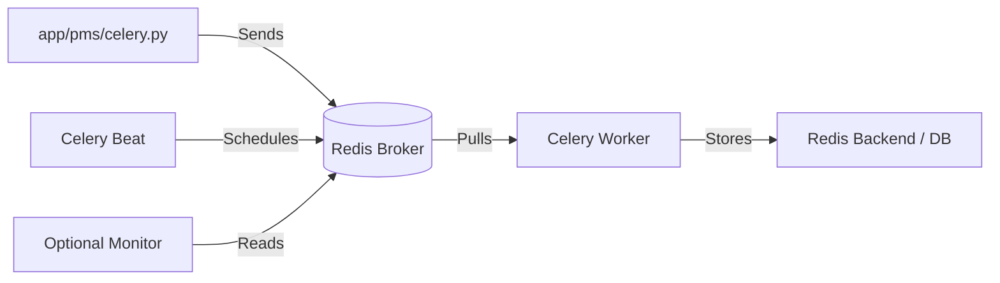

# ⚡ Async Task Architecture (Celery + Redis)

## Why Celery?

- Non-blocking email/SMS delivery
- Scheduled cleanup & report generation
- Heavy computations (translation, PDF export)
- Retry logic with exponential backoff

## Component Setup



## Task Structure

```python
# apps/notifications/tasks.py
@shared_task(bind=True, max_retries=3, default_retry_delay=60)
def send_broadcast_email(self, broadcast_id: str, recipient_emails: list[str]):
    try:
        # 1. Fetch config
        # 2. Render template
        # 3. Send via backend (SMTP/Twilio)
        # 4. Log delivery status
        pass
    except Exception as exc:
        # Exponential backoff: 60s → 120s → 240s
        raise self.retry(exc=exc, countdown=60 * (2 ** self.request.retries))
```

## Common Tasks

| Task Name                | Trigger          | Purpose                         |
| ------------------------ | ---------------- | ------------------------------- |
| `send_broadcast_email`   | API call / Admin | Bulk email delivery             |
| `send_notification`      | Signal / Service | Single user alert               |
| `cleanup_expired_tokens` | Beat (Daily)     | Remove stale JWT refresh tokens |
| `sync_translations`      | Beat (Weekly)    | Compile `.po` → `.mo` files     |

## Worker Configuration

- **Dev**: `celery -A pms.celery worker -l info --pool=solo`
- **Prod**: `celery -A pms.celery worker -l info -c 4` (concurrency)
- **Beat**: `celery -A pms.celery beat -l info` (scheduled tasks)
- **Flower**: `celery -A pms.celery flower --port=5557` (monitoring dashboard)

> 📊 **Monitoring**: Check `docker-compose logs celery_worker` or Flower UI for task states, retries, and failures.
