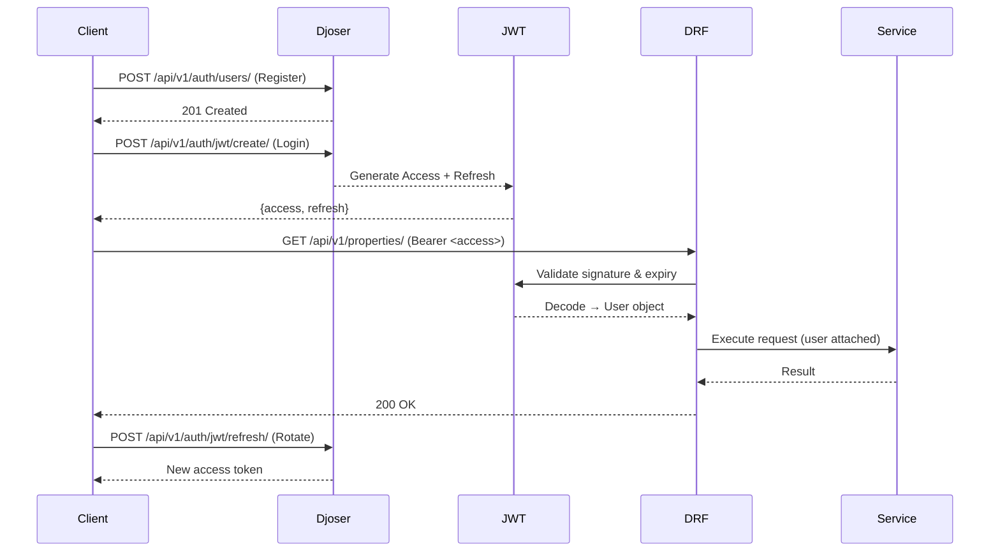

# 🔐 Authentication & Authorization Flow

## JWT Lifecycle



## Role Resolution

1. **JWT Decodes** → extracts `user_id` from payload
2. **DRF Auth** → attaches `request.user` (custom `User` model)
3. **Profile Lookup** → system checks related profile:
   - `OwnerProfile` → sees owned properties, creates leases
   - `ManagerProfile` → sees assigned properties/units
   - `TenantProfile` → sees own leases, submits maintenance
   - `Vendor` → sees assigned maintenance requests
   - `None` → receives empty querysets (default deny)

## Permission Enforcement

| Permission Class               | Where Used            | Behavior                               |
| ------------------------------ | --------------------- | -------------------------------------- |
| `IsAuthenticated`              | All API endpoints     | Requires valid JWT                     |
| `IsOwnerOrManagerOrSuperAdmin` | Properties, Units     | Filters to owned/managed               |
| `IsTenantOrReadOnly`           | Leases, Maintenance   | Tenants can read/create, owners manage |
| `IsAdminOrReadOnly`            | Templates, Broadcasts | Admin-only writes                      |

## Token Settings (`settings/base.py`)

```python
SIMPLE_JWT = {
    "ACCESS_TOKEN_LIFETIME": timedelta(minutes=60),
    "REFRESH_TOKEN_LIFETIME": timedelta(days=7),
    "ROTATE_REFRESH_TOKENS": True,
    "BLACKLIST_AFTER_ROTATION": True,
}
```

> 🔑 **Key Insight**: Permissions are enforced at **both** the view level (DRF) and repository level (query filtering) for defense-in-depth.
