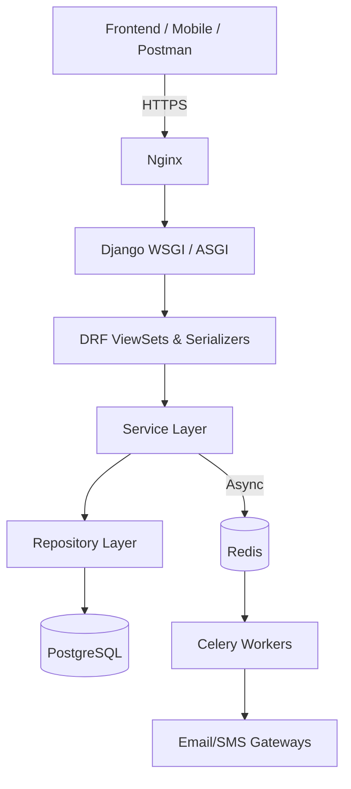

# 🏗️ System Architecture Overview

## High-Level Components

## Core Modules & Responsibilities
| Module | Purpose | Key Models |
|--------|---------|------------|
| `apps.users` | Auth, roles, profiles, permissions | `User`, `OwnerProfile`, `ManagerProfile`, `TenantProfile` |
| `apps.properties` | Property/unit CRUD, images, ownership | `Property`, `Unit`, `PropertyImage`, `PropertyOwnership` |
| `apps.rentals` | Leases, payments, tenant linking | `Lease`, `Payment`, `LeaseTenant` |
| `apps.tenants` | Tenant registry, discoverability, occupancy | `Tenant` |
| `apps.maintenance` | Work orders, vendor assignment, status tracking | `MaintenanceRequest`, `MaintenanceNote`, `Vendor` |
| `apps.payments` | Transaction records, payout methods | `Payment`, `Expense` |
| `apps.notifications` | Templates, broadcasts, delivery tracking | `NotificationTemplate`, `Broadcast`, `UserNotificationSetting` |
| `apps.core` | Base classes, logging, management commands | `BaseRepository`, `BaseService`, `CustomLogger` |

## Data Flow Summary
1. **Request** hits DRF ViewSet → validates input via Serializer
2. ViewSet delegates to `Service` (business logic, transactions)
3. Service calls `Repository` (DB queries, role filtering)
4. Repository interacts with PostgreSQL via Django ORM
5. Heavy/async work (emails, broadcasts, cleanup) dispatched to Celery via Redis
6. Response returned to client with standardized error/success format

## Key Design Principles
- ✅ **Separation of Concerns**: Views ≠ Business Logic ≠ Data Access
- ✅ **Testability**: Repositories mockable, Services unit-testable, Views integration-testable
- ✅ **Role-Aware Data**: Queries filtered at repository level, not just view level
- ✅ **Async-First**: Non-blocking operations pushed to Celery workers
- ✅ **Configurable Storage**: Local dev → Cloudflare R2/S3 prod via `django-storages`

> 📂 **Code Locations**: `apps/` (domain logic), `app/pms/` (settings, celery, routing), `docker/` (infra)

